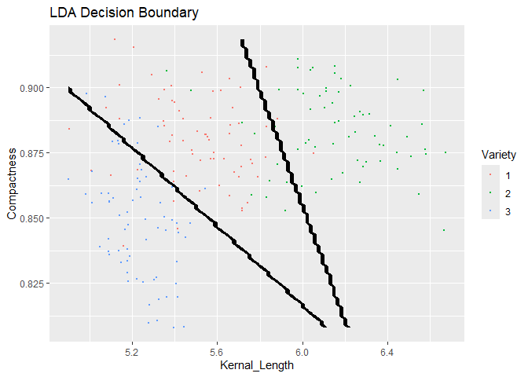
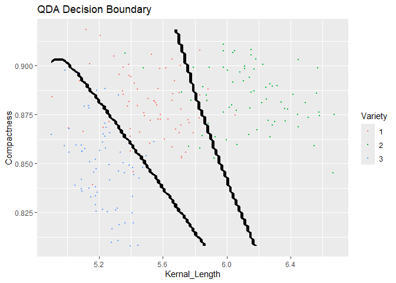

Discriminant Analysis on Seeds Data
================
Erin Gregoire,
October 2024

To explore the linear and quadratic discriminant analysis models, I
conducted this mini-project to classify the variety of seeds.

Preprocessing & Exploratory Data Analysis:

``` r
seeds <- read.delim("seeds.txt", sep = '\t', header = TRUE)

colnames(seeds) <- c('Area', 'Perimeter', "Compactness", "Kernal_Length", 'Width', 'Asymmetry', "Groove_Length", "Variety")
seeds$Variety <- factor(seeds$Variety)

which(is.na(seeds) == TRUE) # no missing data
```

    ## integer(0)

``` r
str(seeds)
```

    ## 'data.frame':    210 obs. of  8 variables:
    ##  $ Area         : num  15.3 14.9 14.3 13.8 16.1 ...
    ##  $ Perimeter    : num  14.8 14.6 14.1 13.9 15 ...
    ##  $ Compactness  : num  0.871 0.881 0.905 0.895 0.903 ...
    ##  $ Kernal_Length: num  5.76 5.55 5.29 5.32 5.66 ...
    ##  $ Width        : num  3.31 3.33 3.34 3.38 3.56 ...
    ##  $ Asymmetry    : num  2.22 1.02 2.7 2.26 1.35 ...
    ##  $ Groove_Length: num  5.22 4.96 4.83 4.8 5.17 ...
    ##  $ Variety      : Factor w/ 3 levels "1","2","3": 1 1 1 1 1 1 1 1 1 1 ...

``` r
head(seeds)
```

    ##    Area Perimeter Compactness Kernal_Length Width Asymmetry Groove_Length
    ## 1 15.26     14.84      0.8710         5.763 3.312     2.221         5.220
    ## 2 14.88     14.57      0.8811         5.554 3.333     1.018         4.956
    ## 3 14.29     14.09      0.9050         5.291 3.337     2.699         4.825
    ## 4 13.84     13.94      0.8955         5.324 3.379     2.259         4.805
    ## 5 16.14     14.99      0.9034         5.658 3.562     1.355         5.175
    ## 6 14.38     14.21      0.8951         5.386 3.312     2.462         4.956
    ##   Variety
    ## 1       1
    ## 2       1
    ## 3       1
    ## 4       1
    ## 5       1
    ## 6       1

``` r
set.seed(777)
indis <- sample(1:nrow(seeds), 2/3*round(nrow(seeds)), replace = FALSE)

seeds_train <- seeds[indis, ]
seeds_test <- seeds[-indis, ] 
```

Implementing LDA and QDA:

``` r
lda.fit <- lda(Variety ~ Kernal_Length + Compactness, data = seeds_train)

lda.train <- predict(lda.fit, newdata = seeds_train)
lda_train_error <- (1/length(seeds_train$Variety)) * length(which(seeds_train$Variety != lda.train$class))

lda.test <- predict(lda.fit, newdata = seeds_test)
lda_test_error <- (1/length(seeds_test$Variety)) * length(which(seeds_test$Variety != lda.test$class))


qda.fit <- qda(Variety ~ Kernal_Length + Compactness, data = seeds)

qda.train <- predict(qda.fit, newdata = seeds_train)
qda_train_error <- (1/length(seeds_train$Variety)) * length(which(seeds_train$Variety != qda.train$class))

qda.test <- predict(qda.fit, newdata = seeds_test)
qda_test_error <- (1/length(seeds_test$Variety)) * length(which(seeds_test$Variety != qda.test$class))


Model = c('LDA', 'QDA')
Train_Error_Rate = c(round(lda_train_error, 4), round(qda_train_error, 4))
Test_Error_Rate = c(round(lda_test_error, 4), round(qda_test_error, 4))
Error_Rate_Table <- data.frame(Model, Train_Error_Rate, Test_Error_Rate)
Error_Rate_Table
```

    ##   Model Train_Error_Rate Test_Error_Rate
    ## 1   LDA           0.1214          0.2000
    ## 2   QDA           0.1214          0.1857

As expected, the training error rate is lower than the test error rate
for both the LDA and QDA models. It is interesting to see that the LDA
and QDA both had the same training error rate. However, the QDA went on
to perform better than the LDA with the test data, which is consistent
with the traditional trends of discriminant analysis. For the seeds
data, the QDA is the optimal model for predicting the variety of wheat
seeds.

``` r
minKL <- min(seeds$Kernal_Length)
maxKL <- max(seeds$Kernal_Length)
minC <- min(seeds$Compactness)
maxC <- max(seeds$Compactness)
KL.range <- seq(from = minKL, to = maxKL, length.out = 100)
C.range <- seq(from = minC, to = maxC, length.out = 100)

grid <- expand.grid(Kernal_Length = KL.range, Compactness = C.range)
grid2 <- expand.grid(Kernal_Length = KL.range, Compactness = C.range)

lda.predict <- predict(lda.fit, newdata = grid)
lda.preds <- lda.predict$class

grid$Variety <- lda.preds

ggplot(seeds, aes(Kernal_Length, Compactness, color = Variety)) +
  geom_point(size = .5) +
  geom_contour(data = grid, aes(z = as.numeric(Variety)), color = "black") +
  labs(title = "LDA Decision Boundary")
```

<!-- -->

This graph shows the decision boundaries created when LDA classifies the
variety of wheat seeds. Overall, the boundaries seem relatively accurate
and reasonable. They seem to favor the red, which is seed variety 1, in
the sense that they have encapsulated the majority of type 1 seeds
within the correct boundaries and less so for the other seeds types.

``` r
qda.predict <- predict(qda.fit, newdata = grid)
qda.preds <- qda.predict$class

grid2$Variety <- qda.preds

ggplot(seeds, aes(Kernal_Length, Compactness, color = Variety)) +
  geom_point(size = .5) +
  geom_contour(data = grid2, aes(z = as.numeric(Variety)), color = "black") +
  labs(title = "QDA Decision Boundary")
```

<!-- -->

The decision boundaries for the QDA look similar to the LDA model,
which is expected, as they both have similar error rates. Overall, these
decision boundaries also seem reasonable and relatively accurate. The
boundaries do well at separating the three varieties with the exception
of outliers, as well as the fact that the categories overlap slightly.
