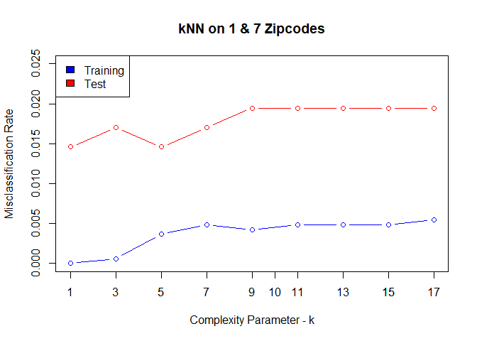

KNN & Linear Model on Zipcode Data
================
Erin Gregoire,
September 2024

To classify zipcodes, I constructed a k-Nearest-Neighbor and Linear Model.
In this mini-project, I demonstrate my skills working with these two
classic models and provide a comparative analysis based on their
performance with the zipcode data.

Data Preprocessing:

``` r
zip.train <- data.frame(zip.train)
zip.test <- data.frame(zip.test)

which(is.na(zip.train) == TRUE) # no missing data
```

    ## integer(0)

``` r
which(is.na(zip.test) == TRUE) # no missing data
```

    ## integer(0)

``` r
zip.train <- zip.train[c(which(zip.train$X1 == 1), which(zip.train$X1 == 7)), ]
zip.test <- zip.test[c(which(zip.test$X1 == 1), which(zip.test$X1 == 7)), ]

zip.train$X1[zip.train$X1==1] <- 0
zip.train$X1[zip.train$X1==7] <- 1

zip.test$X1[zip.test$X1==1] <- 0
zip.test$X1[zip.test$X1==7] <- 1

x_train <- zip.train[,-1]
y_train <- zip.train[,1]

x_test <- zip.test[,-1]
y_test <- zip.test[,1]
```

Implementing kNN:

``` r
kk = c(seq(1, 17, by = 2))
misclass_train <- numeric()
error_train <- numeric()

for (i in 1:length(kk)){
  predict_train <- knn(x_train, x_train, y_train, k=kk[i])
  misclass <- (1/length(y_train))*length(which(y_train !=predict_train))
  errors <- length(which(y_train != predict_train))
  
  misclass_train <- c(misclass_train, misclass)
  error_train <- c(error_train, errors)
  
}

training_profile_knn <- data.frame(kk, error_train, misclass_train)
training_profile_knn
```

    ##   kk error_train misclass_train
    ## 1  1           0   0.0000000000
    ## 2  3           1   0.0006060606
    ## 3  5           6   0.0036363636
    ## 4  7           8   0.0048484848
    ## 5  9           7   0.0042424242
    ## 6 11           8   0.0048484848
    ## 7 13           8   0.0048484848
    ## 8 15           8   0.0048484848
    ## 9 17           9   0.0054545455

``` r
misclass_test <- numeric()
error_test <- numeric()

for (i in 1:length(kk)){
  predict_test <- knn(x_train, x_test, y_train, k=kk[i])
  misclass_ <- (1/length(y_test))*length(which(y_test !=predict_test))
  errors_ <- length(which(y_test != predict_test))

  misclass_test <- c(misclass_test, misclass_)
  error_test <- c(error_test, errors_)
  
}

test_profile_knn <- data.frame(kk, error_test, misclass_test)
test_profile_knn
```

    ##   kk error_test misclass_test
    ## 1  1          6    0.01459854
    ## 2  3          7    0.01703163
    ## 3  5          6    0.01459854
    ## 4  7          7    0.01703163
    ## 5  9          8    0.01946472
    ## 6 11          8    0.01946472
    ## 7 13          8    0.01946472
    ## 8 15          8    0.01946472
    ## 9 17          8    0.01946472

``` r
plot(kk, misclass_train, col = "blue", type = "b", xlab = "Complexity Parameter - k", ylab = "Misclassification Rate", main = "kNN on 1 & 7 Zipcodes", ylim = c(0,.025))
lines(kk, misclass_test, col = "red", type = "b")
axis(1, at=kk, labels = TRUE, tick = TRUE)
legend("topleft", legend=c("Training", "Test"), fill=c("blue", "red"))
```

<!-- -->

The graph shows the misclassification rate for the values of k for the
training data (blue) and the test data (red). As expected, the training
data shows a lower error rate than the test data. The test data does
have a fairly low error rate overall and shows that the k of 5 may be a
good number of neighbors for this dataset.

Fitting a Linear Model:

``` r
lm_train <- lm(X1 ~ ., data = zip.train)

lm_train_ <- predict(lm_train, newdata = x_train)
y_train_hat <- round(lm_train_)

lm_misclass_train <- (1/length(zip.train$X1))*length(which(y_train_hat != zip.train$X1))
lm_misclass_train
```

    ## [1] 0

``` r
lm_test <- predict(lm_train, newdata = x_test)
```

    ## Warning in predict.lm(lm_train, newdata = x_test): prediction from
    ## rank-deficient fit; attr(*, "non-estim") has doubtful cases

``` r
y_test_hat <- round(lm_test)

lm_misclass_test <- (1/length(zip.train$X1))*length(which(zip.train$X1 != y_test_hat))
```

    ## Warning in zip.train$X1 != y_test_hat: longer object length is not a multiple
    ## of shorter object length

``` r
lm_misclass_test
```

    ## [1] 0.4042424

Evaluation & Comparative Analysis:

``` r
Model = c("Linear Model", "kNN - k = 1", "kNN - k = 3", "kNN - k = 5", "kNN - k = 7", "kNN - k = 9", "kNN - k = 11", "kNN - k = 13", "kNN - k = 15", "kNN - k = 17")
Train_Misclassification_Rate = c(round(lm_misclass_train, digits = 4), round(misclass_train, digits=4))
Test_Misclassification_Rate = c(round(lm_misclass_test, digits = 4), round(misclass_test, digits = 4))
Misclassification_Rate_table <- data.frame(Model, Train_Misclassification_Rate, Test_Misclassification_Rate)
Misclassification_Rate_table
```

    ##           Model Train_Misclassification_Rate Test_Misclassification_Rate
    ## 1  Linear Model                       0.0000                      0.4042
    ## 2   kNN - k = 1                       0.0000                      0.0146
    ## 3   kNN - k = 3                       0.0006                      0.0170
    ## 4   kNN - k = 5                       0.0036                      0.0146
    ## 5   kNN - k = 7                       0.0048                      0.0170
    ## 6   kNN - k = 9                       0.0042                      0.0195
    ## 7  kNN - k = 11                       0.0048                      0.0195
    ## 8  kNN - k = 13                       0.0048                      0.0195
    ## 9  kNN - k = 15                       0.0048                      0.0195
    ## 10 kNN - k = 17                       0.0055                      0.0195

This table shows how each model performed using the test and training
data. Again, we see that the training data makes better predictions than
the test data. It is no surprise that when k is 1, there are no errors.
However, it is very surprising to see that the linear model does not
have any errors for the training data. This doesn’t necessarily mean
that it perfectly predicted every outcome as 0 and 1, which represent
the 1 or 7 zipcodes. Rather, it means that when its outcomes were
rounded to either 0 or 1, those predictions then fell into the correct
category for every single outcome. When looking at the test data, it is
not surprising that kNN performs better than the linear model, since
true data is never completely linear.
