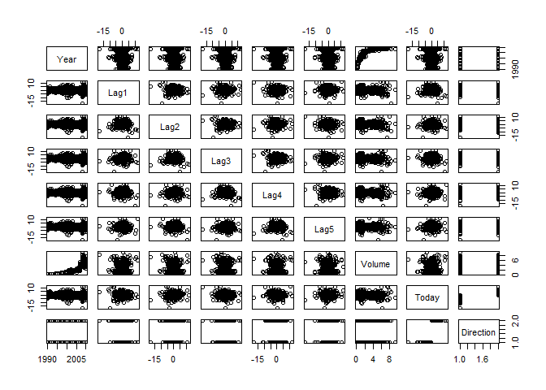
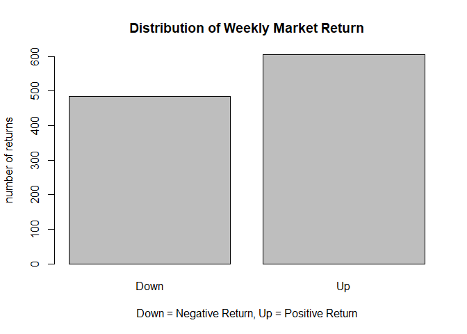
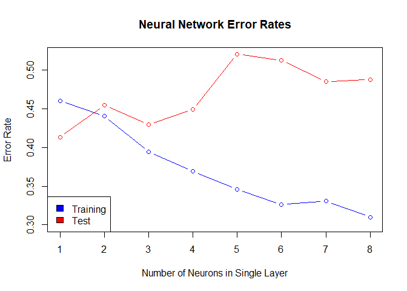

Neural Network on Weekly Stock Returns
================
Erin Gregoire
December 2024

Preprocessing & Exploratory Data Analysis:

``` r
library(ISLR2)
```

    ## Warning: package 'ISLR2' was built under R version 4.5.1

``` r
library(neuralnet)
```

    ## Warning: package 'neuralnet' was built under R version 4.5.1

``` r
data(Weekly)

?Weekly
```

    ## starting httpd help server ... done

``` r
str(Weekly)
```

    ## 'data.frame':    1089 obs. of  9 variables:
    ##  $ Year     : num  1990 1990 1990 1990 1990 1990 1990 1990 1990 1990 ...
    ##  $ Lag1     : num  0.816 -0.27 -2.576 3.514 0.712 ...
    ##  $ Lag2     : num  1.572 0.816 -0.27 -2.576 3.514 ...
    ##  $ Lag3     : num  -3.936 1.572 0.816 -0.27 -2.576 ...
    ##  $ Lag4     : num  -0.229 -3.936 1.572 0.816 -0.27 ...
    ##  $ Lag5     : num  -3.484 -0.229 -3.936 1.572 0.816 ...
    ##  $ Volume   : num  0.155 0.149 0.16 0.162 0.154 ...
    ##  $ Today    : num  -0.27 -2.576 3.514 0.712 1.178 ...
    ##  $ Direction: Factor w/ 2 levels "Down","Up": 1 1 2 2 2 1 2 2 2 1 ...

``` r
pairs(Weekly)
```

<!-- -->
This pairs plot shows the correlation between each of the variables.
From the start, we can see that Volume and Yeah have a sizable
correlation.

``` r
plot(Weekly$Direction, main = "Distribution of Weekly Market Return", ylab = "number of returns", xlab = "Down = Negative Return, Up = Positive Return")
```

<!-- -->

This plot shows the distribution of the response variable of whether the
return is positive or negative.

``` r
table(Weekly$Direction)
```

    ## 
    ## Down   Up 
    ##  484  605

``` r
which(is.na(Weekly) == TRUE) # no missing data
```

    ## integer(0)

``` r
Weekly <- Weekly[ , -8]
Weekly <- Weekly[ , -1]

Weekly$Direction <- as.numeric(Weekly$Direction)-1

set.seed(4)
indis <- sample(1:length(Weekly$Direction), size = (2/3)*length(Weekly$Direction), replace = FALSE)
train <- Weekly[indis, ]
test <- Weekly[-indis, ]
```

Implementing Neural Network:

``` r
train_err_store <- c()
test_err_store <- c()
for (i in 1:8){
  weekly.nn <- neuralnet(Direction ~ ., data = train, hidden = i, linear.output = FALSE)
  
  nn_pred_train <- predict(weekly.nn, newdata = train)
  y_hat_train <- round(nn_pred_train)
  train_err <- length(which(train$Direction != y_hat_train)) / length(y_hat_train)
  train_err_store <- c(train_err_store, train_err)
  
  nn_pred_test <- predict(weekly.nn, newdata = test)
  y_hat_test <- round(nn_pred_test)
  test_err <- length(which(test$Direction != y_hat_test)) / length(y_hat_test)
  test_err_store <- c(test_err_store, test_err)
}

train_err_store
```

    ## [1] 0.4600551 0.4407713 0.3939394 0.3691460 0.3457300 0.3264463 0.3305785
    ## [8] 0.3099174

``` r
test_err_store
```

    ## [1] 0.4132231 0.4545455 0.4297521 0.4490358 0.5206612 0.5123967 0.4848485
    ## [8] 0.4876033

``` r
plot(train_err_store, type = 'b', col = 'blue', ylim = c(0.3, .52), main = "Neural Network Error Rates", ylab = "Error Rate", xlab = "Number of Neurons in Single Layer")
lines(test_err_store, col = 'red', type = 'b')
legend("bottomleft", legend=c("Training", "Test"), fill=c("blue", "red"))
```

<!-- -->
The model with the lowest test error rate is with 3 neurons in the
hidden layer. Although this is not the lowest training error rate, we
want to avoid overfitting.

``` r
weekly.nn.best <- neuralnet(Direction ~ ., data = train, hidden = 3, linear.output = FALSE)
plot(weekly.nn.best)
```

This graph shows the neural network with the optimal model found to have
three neurons in the hidden layer.

Compare to Logistic Regression as a Baseline:

``` r
weekly.log <- glm(Direction ~ ., data = train, family = binomial)
summary(weekly.log)
```

    ## 
    ## Call:
    ## glm(formula = Direction ~ ., family = binomial, data = train)
    ## 
    ## Coefficients:
    ##               Estimate Std. Error z value Pr(>|z|)   
    ## (Intercept)  0.1461396  0.1055269   1.385  0.16610   
    ## Lag1        -0.0366544  0.0315355  -1.162  0.24511   
    ## Lag2         0.0938376  0.0354023   2.651  0.00803 **
    ## Lag3        -0.0128302  0.0334952  -0.383  0.70169   
    ## Lag4         0.0003669  0.0325616   0.011  0.99101   
    ## Lag5        -0.0042240  0.0316699  -0.133  0.89390   
    ## Volume       0.0079551  0.0461540   0.172  0.86315   
    ## ---
    ## Signif. codes:  0 '***' 0.001 '**' 0.01 '*' 0.05 '.' 0.1 ' ' 1
    ## 
    ## (Dispersion parameter for binomial family taken to be 1)
    ## 
    ##     Null deviance: 1001.81  on 725  degrees of freedom
    ## Residual deviance:  992.31  on 719  degrees of freedom
    ## AIC: 1006.3
    ## 
    ## Number of Fisher Scoring iterations: 4

``` r
log_pred_train <- predict(weekly.log, newdata = train, type = "response")
y_hat_train_log <- round(log_pred_train)
log_train_err <- length(which(train$Direction != y_hat_train_log)) / length(y_hat_train_log)
log_train_err
```

    ## [1] 0.4421488

``` r
log_pred_test <- predict(weekly.log, newdata = test, type = "response")
y_hat_test_log <- round(log_pred_test)
log_test_err <- length(which(test$Direction != y_hat_test_log)) / length(y_hat_test_log)
log_test_err
```

    ## [1] 0.4297521

Evaluate and Compare:

``` r
Model = c('Neural Network', 'Logistic Reg.')
Train_Error_Rate = c(round(train_err_store[3], 4), round(log_train_err, 4))
Test_Error_Rate = c(round(test_err_store[3], 4), round(log_test_err, 4))
Error_Rate_Table <- data.frame(Model, Train_Error_Rate, Test_Error_Rate)
Error_Rate_Table
```

    ##            Model Train_Error_Rate Test_Error_Rate
    ## 1 Neural Network           0.3939          0.4298
    ## 2  Logistic Reg.           0.4421          0.4298

After conducting these two models on the training data, it definitely
looks as though the neural network will perform significantly better
than the logistic regression. However, the test data for both models
perform identically. In terms of model interpretability, the neural
network loses significant interpretability with due to its complexity
and number of parameters. However, logistic regression is a very
interpretable and easy to understand model. The logistic regression
model shows that the most important variables in predicting whether the
return will be positive or negative is Lag2 which is the percentage of
return for the 2 previous weeks. Overall, I believe that logistic
regression is a better model for this problem due to equivalent
performance and significantly better model interpretability.
