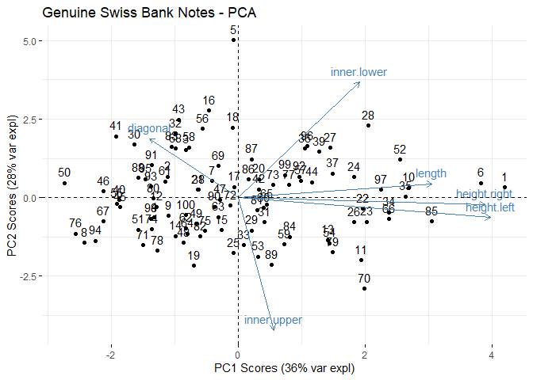
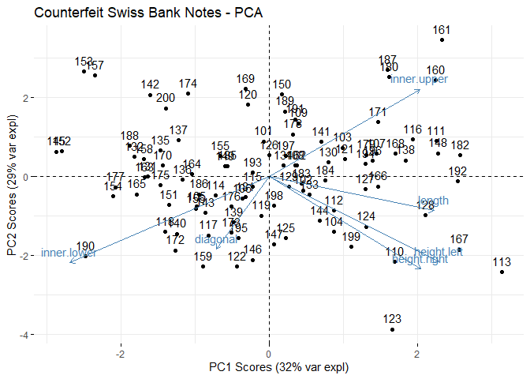
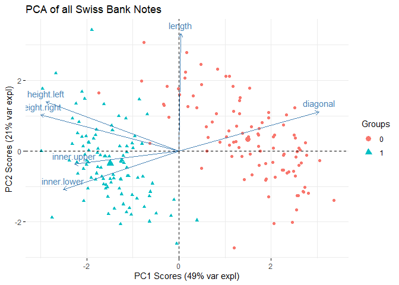
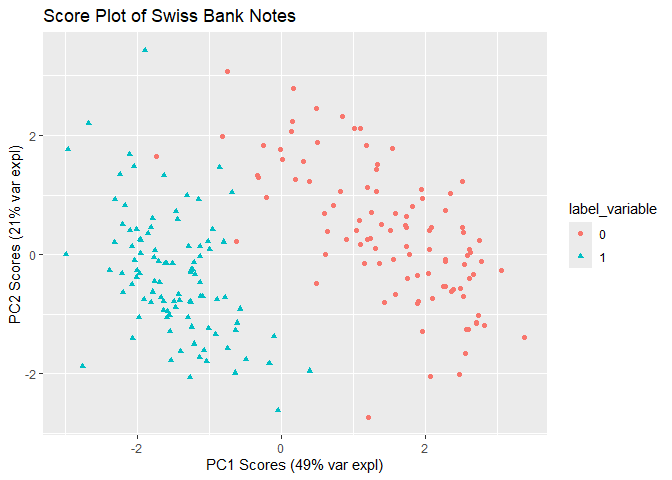

Principal Components Analysis on Swiss Bank Notes
================
Erin Gregoire,
October 2024

Principal Components Analysis is a strong machine learning model for
both supervised and unsupervised learning. In this mini-project, I use
PCA to classify genuine versus counterfeit bank notes.

Data Preprocessing:

Implementing PCA on Genuine Bank Notes:

``` r
gen.pc <- prcomp(scale(genuine), center = FALSE, scale = FALSE)

summary(gen.pc)
```

    ## Importance of components:
    ##                           PC1    PC2    PC3     PC4     PC5     PC6
    ## Standard deviation     1.4845 1.3026 0.9827 0.76348 0.57156 0.47340
    ## Proportion of Variance 0.3673 0.2828 0.1610 0.09715 0.05445 0.03735
    ## Cumulative Proportion  0.3673 0.6501 0.8111 0.90820 0.96265 1.00000

``` r
gen.var.expl <- 100*((gen.pc$sdev)^2) / (sum((gen.pc$sdev)^2))
gen.var.expl
```

    ## [1] 36.730761 28.278484 16.095978  9.714988  5.444697  3.735093

``` r
fviz_pca_biplot(gen.pc, title = "Genuine Swiss Bank Notes - PCA", xlab = "PC1 Scores (36% var expl)", ylab = "PC2 Scores (28% var expl)")
```

<!-- -->

This graph features the variables on the first two principal components.
Likely, height.right, height.left, and length are correlated.
Height.right and height.left have a relatively high degree of variance
as they travel along pc1, indicated by having longer arrows. It is
possible that observations 1, 5, and 6 are outliers. It is important to
note that this graph only shows the first two principal components,
which only capture about 64% of the genuine bank note data. A true
majority of the data is not captured until principal component 3 is
included.

Implementing PCA on Counterfeit Bank Notes:

``` r
cou.pc <- prcomp(scale(counter), center = FALSE, scale = FALSE)

summary(cou.pc)
```

    ## Importance of components:
    ##                           PC1    PC2    PC3    PC4     PC5     PC6
    ## Standard deviation     1.3915 1.3285 0.9941 0.8823 0.56755 0.45840
    ## Proportion of Variance 0.3227 0.2941 0.1647 0.1297 0.05368 0.03502
    ## Cumulative Proportion  0.3227 0.6169 0.7816 0.9113 0.96498 1.00000

``` r
cou.var.expl <- 100*((cou.pc$sdev)^2) / (sum((cou.pc$sdev)^2))
cou.var.expl
```

    ## [1] 32.270246 29.414380 16.471903 12.972787  5.368494  3.502190

``` r
fviz_pca_biplot(cou.pc, title = "Counterfeit Swiss Bank Notes - PCA", xlab = "PC1 Scores (32% var expl)", ylab = "PC2 Scores (29% var expl)")
```

<!-- -->

The PCA of the counterfeit banknotes, at first looks similar to the
genuine banknotes when comparing the importance of components and that
the variance is best explained over three principal components. Looking
at the graph of counterfeit banknotes, the height.left and height.right
appear to be correlated as well. The inner.lower and inner.upper appear
to be negatively correlated. Similarly to the genuine bank note data,
the diagonal variable appears to have a low degree of variance due to
the shortened arrow, and therefore less influence on the principal
components.

Fitting PCA on Combined Swiss Bank Notes:

``` r
# variable where 0 represents genuine and 1 represents counterfeit
label_variable <- rep(0, 200)
label_variable[101:200] <- 1
label_variable <- factor(label_variable)
```

``` r
full.pc <- prcomp(scale(SwissBankNotes), center = FALSE, scale = FALSE)
summary(full.pc)
```

    ## Importance of components:
    ##                           PC1    PC2    PC3     PC4     PC5     PC6
    ## Standard deviation     1.7163 1.1305 0.9322 0.67065 0.51834 0.43460
    ## Proportion of Variance 0.4909 0.2130 0.1448 0.07496 0.04478 0.03148
    ## Cumulative Proportion  0.4909 0.7039 0.8488 0.92374 0.96852 1.00000

``` r
full.var.expl <- 100*((full.pc$sdev)^2) / (sum((full.pc$sdev)^2))
full.var.expl
```

    ## [1] 49.092637 21.301396 14.483876  7.496145  4.477948  3.147998

``` r
fviz_pca_biplot(full.pc, title = "PCA of all Swiss Bank Notes", label = 'var', habillage = label_variable, xlab = "PC1 Scores (49% var expl)", ylab = "PC2 Scores (21% var expl)")
```

<!-- -->

This biplot shows the genuine bank notes in red and the counterfeit bank
notes in blue. The genuine and counterfeit bank notes have created their
own separate clusters. The genuine bank notes have a stronger
association with diagonal and length, meaning that these variables are
better at predicting the genuine bank notes. This is interesting as
diagonal did not seem to be a very important indicator when looking a
the PCA of only genuine bank notes. The pair's inner.lower and
inner.upper, as well as height.left and height.left appear to be
correlated with each other. It is interesting that the inner.lower, and
inner.upper are showing a positive correlation here because they had a
very strong negative correlation in the PCA of only counterfeit bank
notes. Also, these four predictors appear to be associated with the
counterfeit bank notes, showing that they would be better at predicting
that a bank note is not real.

``` r
scores <- full.pc$x
dats <- data.frame(scores, label_variable)

score.plot <- ggplot(dats, aes(PC1, PC2, color = label_variable, shape = label_variable)) + geom_point()
score.plot + labs(title = "Score Plot of Swiss Bank Notes", x = "PC1 Scores (49% var expl)", y = "PC2 Scores (21% var expl)")
```

<!-- -->

In this score plot, we see that genuine bank notes are shown in red and
counterfeit bank notes are in blue. The genuine and counterfeit bank
notes have created clusters with their own respective category. We can
see that a few of the genuine bank notes are falling close to the
counterfeit bank notes, which indicates that their properties may be
more similar to the counterfeit bank notes and may lead these genuine
notes to be categorized incorrectly as counterfeit. Since there is such
a distinction between these two types of notes, it shows that PCA is an
effective model for determining the genuineness of Swiss bank notes.
